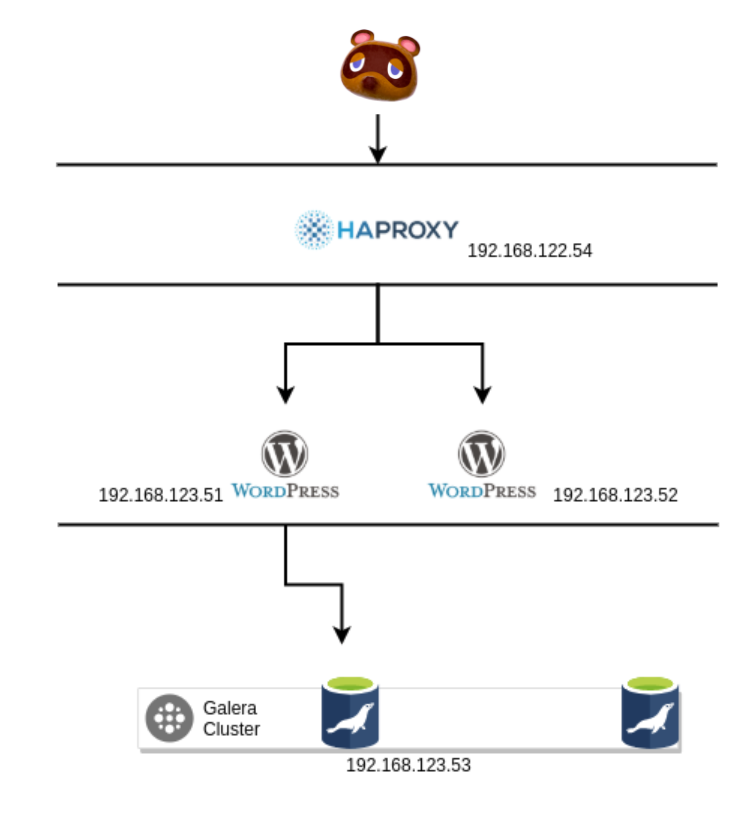

### Overview

Wordpress 와 MariaDB로 구성된 2-Tier 아키텍쳐를 제공합니다.  사용자는 외부 HAPROXY를 통해 Wordpress로 Roudrobin 되어 연결되 고가용성을 보장합니다. . Wordpress는 데이터베이스인 MariaDB와 연결되며, MariaDB는 Galera Module 을 통해 서로 데이터를 공유하게 됩니다. 설치과정은 생략하고, 모든건 Ansible Role 기반으로 배포됩니다.

- Role
- Network Configuration
- System Configuration

### Architecture

### Note

- 해당 서비스는 AWX로 배포되었습니다. Ansible만 사용해서 배포해도 되지만 필요하면, AWX를 사용해도 됩니다.
- AWX 설치 및 구성은 [공식문서](https://github.com/ansible/awx)를 참고해주세요.

### How to Test

- 외부에 노출된 HAPROXY로 "curl"을 실행해 웹 브라우저를 확인합니다.
- 지속적인 "curl" 을통해 각 Wordpress 웹서버의 IP를 확인해 로드벨런싱되는지 확인합니다.
- Wordpress 서버로 SSH로 연결해 MariaDB에 'telnet'을 통해 연결합니다.

### Open Source

- Ansible
- Ansible Worker (AWX)
- Wordpress
- MariaDB
- KVM
- Galera Cluster

### References

[https://github.com/ansible/awx](https://github.com/ansible/awx)

[https://daddyprogrammer.org/post/8393/ansible-wordpress-nginx-mariadb-php/](https://daddyprogrammer.org/post/8393/ansible-wordpress-nginx-mariadb-php/)

[https://www.tutorialspoint.com/ansible/ansible_roles.htm](https://www.tutorialspoint.com/ansible/ansible_roles.htm)
